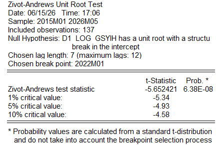
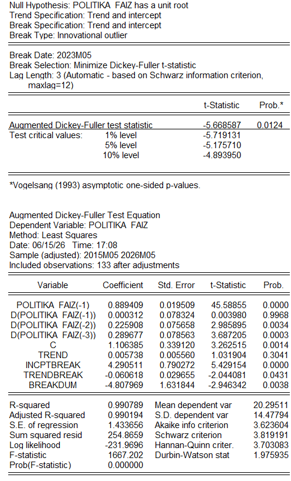
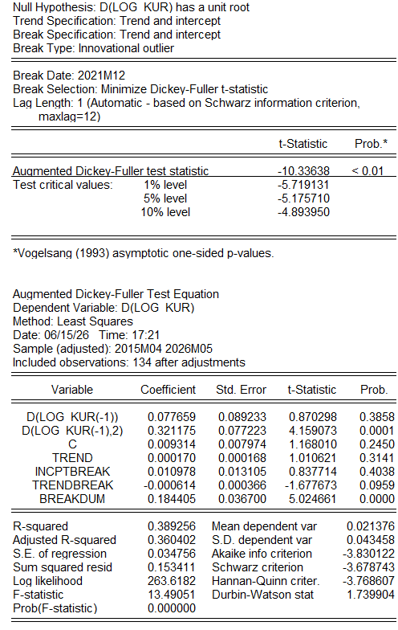
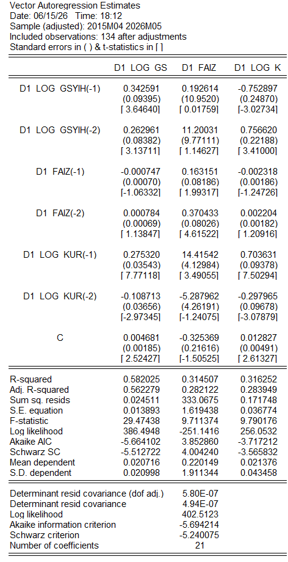
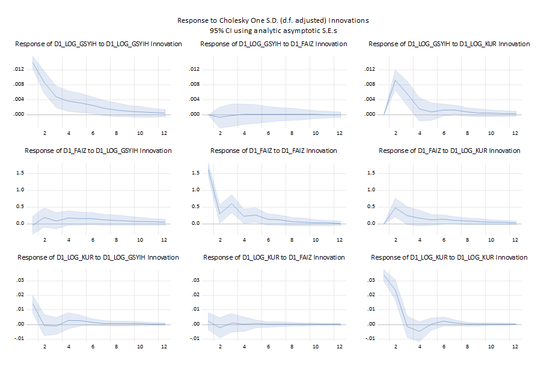
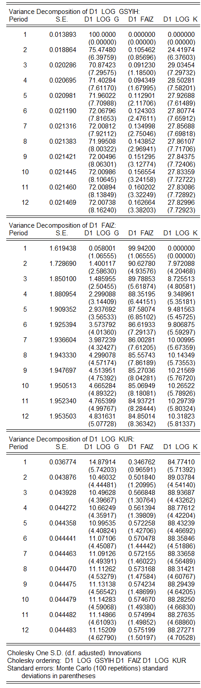
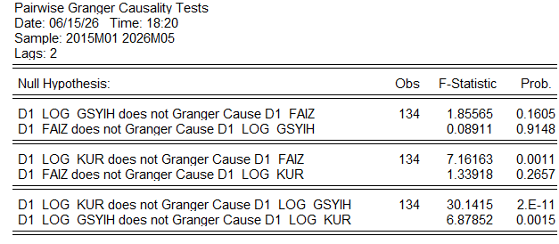
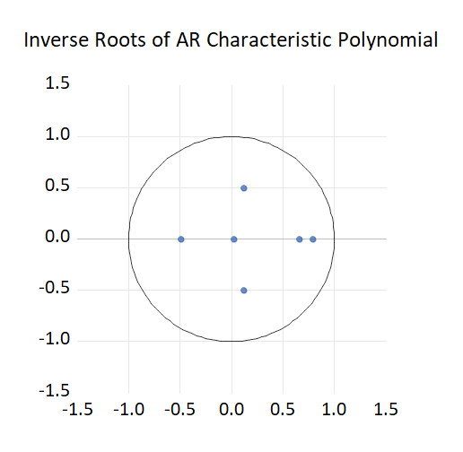
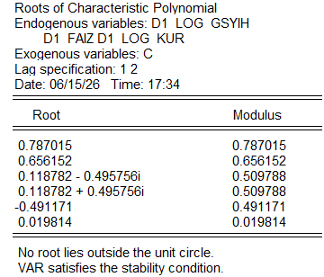

# 📊 Monetary Policy Transmission & Macroeconomic Dynamics For TURKEY
### An Empirical VAR Analysis | EViews 13

> *Uncovering how central bank interventions propagate through financial markets and the real economy using Vector Autoregression.*

---

## 🔍 Project Overview

This project presents a rigorous empirical macro-econometric analysis evaluating the **transmission channels of monetary policy**, exchange rate shocks, and economic activity. Using an **Unrestricted Vector Autoregression (VAR)** framework modeled in **EViews 13**, the project uncovers the structural interactions between policy interest rates, foreign exchange dynamics, and aggregate output.

Understanding how central bank decisions ripple through financial markets is vital for both policymakers and investment strategists. This model captures those dynamics using high-frequency tracking methods, validated through strict diagnostic and stability testing.

---

## 📦 Variables Analyzed

| Variable | Description | Unit |
|---|---|---|
| `POLITIKA_FAIZI` | Central Bank Policy Interest Rate | % |
| `L_KUR` | Natural Log of USD/Local Currency Exchange Rate | ln |
| `L_GSYIH_SA` | Natural Log of Seasonally Adjusted GDP (Census X-13) | ln |

- **Data Frequency:** Quarterly / Monthly Macroeconomic Time Series
- **Software:** EViews 13
- **Estimation Method:** Unrestricted VAR with optimal lag selection

---

## 🛠️ Methodology

To avoid spurious regression and capture true short-run dynamics, all non-stationary series were transformed using **first-differences** after satisfying unit root properties. An **Unrestricted VAR** model was then estimated using information criteria (AIC / SC / HQ) for lag selection.

### Step 1 — Unit Root Testing (Zivot-Andrews & ADF with Structural Breaks)

Before estimation, each series was tested for stationarity using the **Zivot-Andrews** and **Augmented Dickey-Fuller** tests, accounting for structural breaks in the data.

**GDP Unit Root Test** — Zivot-Andrews (Break in Intercept, Break Point: 2022M01)



**Policy Rate Unit Root Test** — ADF with Structural Break (Break Date: 2023M05)



**Exchange Rate Unit Root Test** — ADF with Structural Break (Break Date: 2021M12)



> All series were confirmed to be **I(1)** — integrated of order one. First-differencing renders them stationary and suitable for VAR estimation.

---

### Step 2 — VAR Model Estimation

The unrestricted VAR was estimated over the sample period **2015M04–2026M05** with **2 lags**, as selected by information criteria. The system includes the three first-differenced variables:

```
D(L_GSYIH_SA)   D(L_KUR)   D(POLITIKA_FAIZI)
```



---

## 📈 Empirical Findings

### 1 · Impulse Response Functions (IRFs)

Structural shock simulations using **Cholesky One S.D. Innovations** reveal crucial insights into economic transmission mechanisms.



**Key Findings:**

- **Exchange Rate → Policy Rate Channel:** A positive shock to the exchange rate triggers an immediate, aggressive policy response. The policy rate sharply increases up to **Period 2** as a defensive monetary reflex, before stabilizing and dissipating by **Period 4**.

- **Exchange Rate → Output Channel:** A one-unit positive shock to the exchange rate expands nominal GDP figures up to Period 2 due to price inflation and **currency pass-through (valuation effect)**. This underscores the necessity of using *Real GDP* rather than nominal indices for pure growth evaluation.

---

### 2 · Variance Decomposition

Variance decomposition traces where volatility originates over a **12-period horizon**.



| Variable | Own Shocks | Exchange Rate Shocks | Monetary Policy Shocks |
|---|---|---|---|
| GDP (`D1_LOG_GSYIH`) | ~72% | ~28% | ~0.2% |
| Policy Rate (`D1_FAIZ`) | ~85% | ~10% | — |
| Exchange Rate (`D1_LOG_KUR`) | ~89% | — | ~0.6% |

**Interpretation:**

- **GDP Volatility** is substantially explained by exchange rate shocks (~28%), highlighting the strong currency-output nexus in this economy.
- **Exchange Rate Volatility** is dominated by its own intrinsic shocks (~89%). In import-dependent emerging markets, aggregate demand expansions naturally accelerate imports, generating upward pressure on the currency.
- **Policy Rate Volatility** is partially driven by exchange rate shocks (~10%), confirming that central bank reactions are systematically linked to currency movements.

---

### 3 · Granger Causality Testing

Pairwise Granger causality tests confirm that past values of variables hold **statistically significant predictive power** over current indicators.



| Causal Relationship | F-Statistic | p-value | Conclusion |
|---|---|---|---|
| KUR → FAIZ | 7.162 | 0.0011 | ✅ Significant |
| FAIZ → KUR | 1.339 | 0.2657 | ❌ Not significant |
| KUR → GSYIH | 30.141 | 2.2E-11 | ✅ Highly significant |
| GSYIH → KUR | 6.879 | 0.0015 | ✅ Significant |
| GSYIH → FAIZ | 1.856 | 0.1605 | ❌ Not significant |
| FAIZ → GSYIH | 0.089 | 0.9148 | ❌ Not significant |

**Key Takeaways:**

- **KUR → FAIZ** *(p < 0.05)*: Exchange rate fluctuations Granger-cause policy interest rates. The central bank adjusts its policy stance in response to external trade and currency developments.
- **GSYIH ↔ KUR** *(bidirectional)*: A continuous feedback loop exists between economic output and exchange rates — economic expansion affects the currency, which in turn feeds back into growth.

---

## 🛡️ Diagnostics & Model Stability

To validate the VAR system's robustness, standard diagnostic checks were performed. The model successfully meets all structural requirements for valid econometric inference.

### AR Characteristic Roots — Stability Check

All estimated inverse roots of the AR characteristic polynomial lie **strictly inside the unit circle**, confirming that the VAR system is:

- ✅ **Stable** — no explosive behavior
- ✅ **Stationary** — bounded dynamics
- ✅ **Valid** — impulse response estimates are mathematically non-explosive

**AR Roots Table**



**AR Roots Plot — Inverse Roots of Characteristic Polynomial**



> *No root lies outside the unit circle. The VAR satisfies the stability condition.*

---

## 🧰 Technical Stack

| Tool | Purpose |
|---|---|
| **EViews 13** | VAR estimation, IRF, variance decomposition, causality tests |
| **Census X-13** | Seasonal adjustment of GDP series |
| **Zivot-Andrews Test** | Unit root testing with structural breaks |
| **Cholesky Decomposition** | Orthogonalization of shocks for IRF |

---

## 📋 Summary of Results

```
✦ VAR Model: Unrestricted, 2 lags, 3 variables
✦ Sample: 2015M04 – 2026M05 (134 observations after adjustments)
✦ Stability: All AR roots inside unit circle ✓
✦ Key Transmission Channel: KUR → FAIZ → GSYIH
✦ GDP Variance Explained by Exchange Rate: ~28%
✦ Bidirectional Causality: GDP ↔ Exchange Rate
```

---

*Analysis conducted using EViews 13. All series first-differenced to ensure stationarity prior to VAR estimation.*